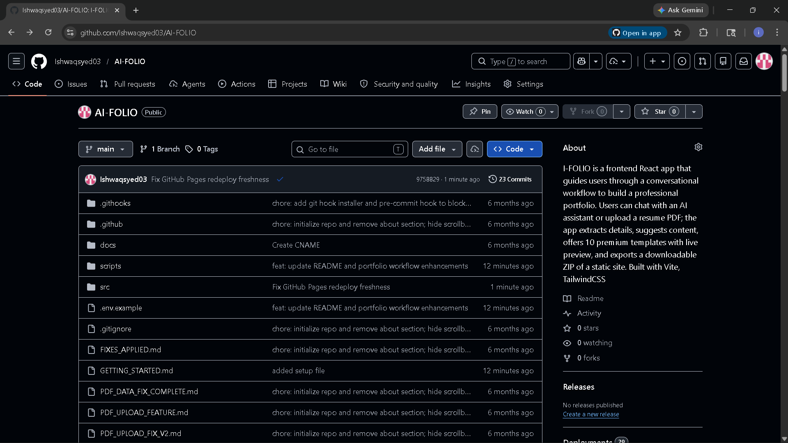

# AI Portfolio Maker 🎨✨

Create stunning portfolio websites with the power of AI! AI Portfolio Maker is a frontend-only application that uses conversational AI to collect your information and generates beautiful, ready-to-deploy portfolio websites.

## 🌟 Features

- **🤖 AI-Powered Data Collection**: Interactive chatbot powered by Google Gemini API collects your portfolio information through natural conversation
- **🧠 ML Skills Extraction & Auto-Tagging**: Paste resume/LinkedIn text and extract skills, experience, and projects automatically using HuggingFace NER inference
- **💡 Smart Suggestions**: Get contextual suggestions after every chatbot response for faster data entry
- **🎨 10 Premium Templates**: Choose from 10 professionally designed portfolio templates:
  - Modern Minimal
  - Creative Gradient
  - Professional Dark
  - Bold Colorful
  - Elegant Classic
  - Tech Futuristic
  - Clean Corporate
  - Artistic Portfolio
  - Developer Showcase
  - Designer Creative
- **👀 Live Preview**: See your portfolio come to life in real-time with responsive preview (desktop, tablet, mobile)
- **📦 One-Click Download**: Download your complete portfolio as a .zip file ready for deployment
- **🚀 Push it to GitHub**: Deploy directly from the preview screen to a GitHub repository and publish with GitHub Pages
- **✨ Premium UI**: Framer Motion animations, gradient themes, and glass-morphism effects
- **🚀 No Backend Required**: 100% client-side application
- **🖥️ Local LLM Fallback (Ollama)**: Keep AI features running when Gemini quota is exhausted by using a local model
- **📱 Fully Responsive**: All templates work perfectly on all devices

## 🚀 Quick Start

### Prerequisites

- Node.js 18+ installed
- Google Gemini API key ([Get one here](https://makersuite.google.com/app/apikey))
- HuggingFace API key for NER extraction ([Get one here](https://huggingface.co/settings/tokens))
- Optional for quota-free local fallback: [Ollama](https://ollama.com/) installed locally

### Installation

1. **Clone the repository**
   ```bash
   cd "c:\ishwaq college\projectss\AI-FOLIO"
   ```

2. **Install dependencies**
   ```bash
   npm install
   ```

3. **Add your API keys**
   The install step creates `.env` from `.env.example` if it does not exist.
   You can also auto-fill it during install:
   ```bash
   # macOS/Linux
   VITE_GEMINI_API_KEY=your_api_key_here
   VITE_HF_API_KEY=your_huggingface_api_key_here
   npm install

   # Windows (PowerShell)
   $env:VITE_GEMINI_API_KEY="your_api_key_here"; $env:VITE_HF_API_KEY="your_huggingface_api_key_here"; npm install
   ```
   Or edit `.env` manually and add:
   ```bash
   VITE_GEMINI_API_KEY=your_api_key_here
   VITE_HF_API_KEY=your_huggingface_api_key_here
   VITE_HF_RESUME_NER_MODEL=jjzha/jobbert_skill_extraction
   ```

4. **Start development server**
   ```bash
   npm run dev
   ```

### Run with Local Model (Ollama fallback)

If Gemini is rate-limited or unavailable, you can run a local model:

1. Start Ollama and pull a model:
   ```bash
   ollama pull llama3.1:8b-instruct
   ```

2. Start the local AI proxy server (new terminal):
   ```bash
   npm run dev:server
   ```

3. Start frontend (another terminal):
   ```bash
   npm run dev
   ```

4. Ensure `.env` has:
   ```bash
   VITE_ENABLE_LOCAL_MODEL=true
   VITE_LOCAL_AI_BASE_URL=http://localhost:11435
   ```

Local fallback is used automatically for chat, resume parsing, and ATS suggestions when Gemini fails.

5. **Open your browser**
   Navigate to `http://localhost:3000`

## 🎯 How to Use

1. **Paste & Auto-Extract (Fastest)**: Paste your resume or LinkedIn text and click **Auto-Extract with ML** to auto-tag skills, experience, and projects

2. **Chat with AI**: Answer the chatbot's questions about your professional background
   - Name and title
   - Bio/About me
   - Skills
   - Work experience
   - Projects
   - Education
   - Contact information

3. **Use Quick Replies**: Click on suggested responses to speed up the process

4. **Select Template**: Choose from 10 beautiful portfolio designs

5. **Preview**: View your portfolio in desktop, tablet, or mobile view

6. **Download**: Click "Download Portfolio" to get a complete .zip file with:
   - HTML file
   - CSS file
   - README with deployment instructions
   - All assets included

7. **Push it to GitHub** (optional):
   - Open Live Preview and click **Push it to GitHub**
   - Provide a fine-grained GitHub Personal Access Token (PAT)
   - Enter repository name
   - Click **Deploy Now**
   - The app creates/updates the repo, enables GitHub Pages, and shows your live link

### GitHub Token Permissions

For the deploy button, use a fine-grained token with these repository permissions:
- **Contents**: Read and Write
- **Pages**: Read and Write
- **Metadata**: Read-only

## 📦 What's in the Downloaded Portfolio?

Your downloaded portfolio includes:
- ✅ Complete, standalone HTML file
- ✅ Custom CSS styles
- ✅ README with deployment instructions
- ✅ Fully responsive design
- ✅ Ready to deploy on Vercel, Netlify, GitHub Pages, etc.

## 🌐 Deployment

### Vercel (Recommended)

1. Install Vercel CLI
   ```bash
   npm install -g vercel
   ```

2. Deploy
   ```bash
   npm run build
   vercel --prod
   ```

### Netlify

1. Build the project
   ```bash
   npm run build
   ```

2. Drag and drop the `dist` folder to [Netlify Drop](https://app.netlify.com/drop)

### GitHub Pages

1. Build the project
   ```bash
   npm run build
   ```

2. Push the `dist` folder contents to your GitHub repository
3. Enable GitHub Pages in repository settings

## 🛠️ Technology Stack

- **Frontend Framework**: React 18
- **Styling**: TailwindCSS
- **Animations**: Framer Motion
- **AI Integration**: Google Gemini API
- **ML Extraction**: HuggingFace Inference API (NER)
- **File Generation**: JSZip + FileSaver.js
- **Icons**: Lucide React
- **Build Tool**: Vite

## 📁 Project Structure

```
AI-FOLIO/
├── src/
│   ├── components/
│   │   ├── ChatBot.jsx          # AI chatbot interface
│   │   ├── TemplateSelector.jsx # Template selection UI
│   │   └── LivePreview.jsx      # Portfolio preview
│   ├── templates/
│   │   ├── ModernMinimal.jsx
│   │   ├── CreativeGradient.jsx
│   │   ├── ProfessionalDark.jsx
│   │   ├── BoldColorful.jsx
│   │   ├── ElegantClassic.jsx
│   │   ├── TechFuturistic.jsx
│   │   ├── CleanCorporate.jsx
│   │   ├── ArtisticPortfolio.jsx
│   │   ├── DeveloperShowcase.jsx
│   │   ├── DesignerCreative.jsx
│   │   └── index.js
│   ├── utils/
│   │   ├── gemini.js            # Gemini API integration
│   │   └── zipGenerator.js      # ZIP file generation
│   ├── App.jsx
│   ├── main.jsx
│   └── index.css
├── public/
├── index.html
├── package.json
├── vite.config.js
├── tailwind.config.js
└── README.md
```

## 🎨 Template Showcase

Each template is carefully crafted with:
- Unique visual design
- Professional typography
- Smooth animations
- Mobile-first responsive design
- Optimized for readability and impact

## 🔧 Configuration

### Gemini API

Create a `.env` file in the root directory:

```env
VITE_GEMINI_API_KEY=your_gemini_api_key_here
VITE_HF_API_KEY=your_huggingface_api_key_here
VITE_HF_RESUME_NER_MODEL=jjzha/jobbert_skill_extraction
```

Get your API key from [Google AI Studio](https://makersuite.google.com/app/apikey)

## 🤝 Contributing

Contributions are welcome! Feel free to:
- Report bugs
- Suggest new features
- Submit pull requests
- Add new templates

## 📝 License

This project is open source and available under the MIT License.

## 🙏 Acknowledgments

- Google Gemini API for powering the conversational AI
- TailwindCSS for the utility-first styling
- Framer Motion for smooth animations
- The React community

## 📞 Support

If you encounter any issues or have questions:
- Check the [Issues](https://github.com/yourusername/ai-portfolio-maker/issues) page
- Create a new issue with detailed information
- Star ⭐ this repository if you find it useful!

---

**Made with ❤️ and AI**

Happy portfolio building! 🎉
